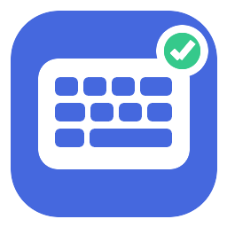

<div align="center">
  
  <h1>KeySwitchFix</h1>
  <p>Lightweight, private, automatic keyboard layout repair for Windows: Persian ↔ English, or any two languages you choose, with spelling correction for Persian and English.</p>

  [](https://github.com/samaliyan/KeySwitchFix/actions/workflows/ci.yml)
  [](https://github.com/samaliyan/KeySwitchFix/releases/latest)
  [](LICENSE.txt)
  [](#requirements)

  [Download](https://github.com/samaliyan/KeySwitchFix/releases/latest) · [Persian README](README_FA.md) · [Report a bug](https://github.com/samaliyan/KeySwitchFix/issues/new?template=bug_report.yml)
</div>

## What it does

KeySwitchFix notices when a word or sentence fragment was typed using the wrong
keyboard layout, replaces it, and switches the target application's layout
automatically. It works between English and Persian out of the box, and
between any two of 16 languages you pick on the dashboard (see
[Language pairs](#language-pairs)).

| Physical keys | Wrong output | Corrected output |
| --- | --- | --- |
| `password` | `حشسسصخقی` | `password` |
| `sghl` | `sghl` | `سلام` |
| `;jhf` | `;jhf` | `کتاب` |
| `nv clhkd ;i` | `nv clhkd ;i` | `در زمانی که` |

Detection is confidence-based: the intended word must exist in the opposite-language dictionary while the text produced by the active layout must not. Proper-prefix guards prevent valid words from being changed while they are still being typed. Unambiguous mistakes are corrected immediately; ambiguous matches are checked after an adaptive typing pause or at Space, Enter, or Tab.

Version 4.0 lets you choose the **two languages** you switch between: English,
Persian, Arabic, Bulgarian, Dutch, French, German, Greek, Hebrew, Italian,
Polish, Portuguese, Russian, Spanish, Turkish or Ukrainian, in any
combination (`ghbdtn` → `привет` for English and Russian, `yeitung` →
`zeitung` for English and German). The languages beyond English and Persian
come as language packs built from wordfreq; anyone can build a pack for
another language. It is also the result of a full independent review of the
whole program. See the [changelog](CHANGELOG.md) and
[Language packs](docs/LANGUAGE_PACKS.md).

Version 3.2 is a reliability and design release: a new dashboard with four
pages (Correction, Typing, Memory & words, Statistics) whose settings apply
instantly, full keyboard navigation, per-monitor DPI scaling that always keeps
every control on screen, a grey tray icon while paused, and password fields in
browsers detected through accessibility. It stops corrections after Enter or
Tab, in remote-desktop windows and in Office autocorrect conflicts, fixes stuck
modifier keys, and leaves the IT terms and pack words you type alone. In
snippets, Enter and Tab are now written `{n}` and `{t}` (backslashes are typed
as they are, so Windows paths work); an existing `snippets.txt` is converted
automatically. See the [changelog](CHANGELOG.md).

Version 3.1 adds an opt-in **writing memory** that learns the repairs you
make by hand (`عسیسم` → `عزیزم` after you fix it twice) and the words you
use most, kept only on your PC, and an **IT & computing vocabulary** of
1,400 terms (`kubernetes`, `tablespace`, `کانفیگ`, `دیتابیس`). See
[Writing memory](docs/WRITING_MEMORY.md).

Version 3.0 adds **typing helpers**: Persian digits and punctuation that
follow the language you are writing, Arabic `ي ك` typed as Persian `ی ک`,
English sentence capitalisation, snippets with Jalali and Gregorian date
macros (`tarikh` → `۱۴۰۵/۰۶/۲۱`), a `Ctrl + Win + X` hotkey that cleans up any
selected text, and usage statistics on the dashboard. It also fixes the
layout switch in Store/UWP applications and in applications that ignore or
delay the switch (`staدیشقی` → `standard`). See
[Typing helpers](docs/TYPING_HELPERS.md).

Version 2.9 adds offline spelling correction for both languages: `نسحه` →
`نسخه`, `teh` → `the`. A noisy-channel model scores every candidate within
one edit by corpus frequency and by how people actually mistype (transposed
letters, neighbouring keys, doubled letters, Persian homophones). It runs at
the word boundary, only for words unknown in both layouts, and one Backspace
undoes it and remembers the spelling. See [Spelling](docs/SPELLING.md).

Version 2.8 adds a keyboard-hook watchdog, Shift+Space (ZWNJ) awareness for
words such as `می‌خواهم`, a per-app exclusion shortcut on the tray menu, a
`Ctrl + Win + K` pause hotkey, and a DPI-aware dashboard.

Version 2.7 combines both dictionary candidates, common/frequent vocabulary,
sentence position, weighted document language, normalized bilingual frequency,
typing phase, prefix safety, and continuous current-sentence review. It keeps
the sentence from its beginning (up to 32 words or 512 characters), reevaluates
it at each Space, and can use a later word to revise earlier ambiguous text.
An explicit preference remains available for collisions that cannot be
inferred from the available keys or context alone.

## Highlights

- Native Win32 C application with no .NET or external runtime
- Any two languages: English and Persian built in, 14 more as language packs (Arabic, Bulgarian, Dutch, French, German, Greek, Hebrew, Italian, Polish, Portuguese, Russian, Spanish, Turkish, Ukrainian), and a tool to build packs for others
- Offline spelling correction for Persian and English with Off / Conservative / Balanced / Aggressive levels
- Half-space (`می‌پرسیدند`) and missing-space (`in the`, `در خانه`) repair
- Learns your own vocabulary: a word typed twice is never "corrected"; an optional personal dictionary keeps undone words across restarts
- Effective union of 159,852 offline English and Persian spellings
- 20,000 common and 2,000 frequent entries per language from wordfreq 3.1.1
- Works across desktop applications using physical scan-code mapping
- Supports both Windows **Persian** and **Persian (Standard)** key layouts
- Corrects clear mistakes while typing, without waiting for Space
- Protects valid longer words with offline prefix dictionaries and an adaptive pause
- Recognizes common two-key and three-key words using sentence context
- Re-evaluates the current sentence from its beginning, so later evidence can repair earlier words
- Auto mode for ambiguous collisions, or a fixed preference for either language of the pair
- Recognizes common unshifted initial `آ` spellings such as `ایا`
- Undo the latest correction with one plain **Backspace**; `Ctrl + Win + Backspace` remains a fallback
- Treats Shift+Space as a Persian ZWNJ boundary, so `می‌خواهم` and `کتاب‌ها` are repaired and re-typed exactly
- Re-arms its keyboard hook automatically if Windows silently detaches it
- Types the keys itself while an application is slow to switch layouts, or never does, so `standard` never becomes `staدیشقی`; finds the real input window of Store/UWP apps
- Digits that follow the language (`۱۲۳` in Persian, `123` in English), Persian `؟ ، ؛` after Persian words, Arabic `ي ك` typed as Persian `ی ک`
- Capitalises English sentences and the lone `i`, without touching code editors
- Snippets with date and time macros, including the Jalali calendar (`{jdate:long}` → `۲۱ شهریور ۱۴۰۵`)
- `Ctrl + Win + X` cleans up selected text anywhere (Persian letters, digits, punctuation, when Persian is one of your two languages), and puts your clipboard back
- Statistics: fixes today and all time, keys, active days, time saved, most-corrected words
- **Exclude this app** from the tray menu and `Ctrl + Win + K` to pause/resume
- English-only dashboard (settings apply instantly), tray controls and a Statistics page with diagnostics
- Per-user installer, desktop/Start Menu shortcuts, startup option, and clean uninstaller
- No network access, telemetry, cloud processing, typed-text log, or background service (the opt-in writing memory keeps only word counts and repairs, on your PC)
- Compact native executable with all word resources embedded

## Language pairs

Open the dashboard and choose the two languages on the **Correction** page
(**Languages**). Both keyboards must be installed in Windows
(**Settings → Time & language → Language & region**). The change applies at
once; the status card names a keyboard that is missing.

- English and Persian are built in. They also have spelling correction, the
  IT vocabulary and the typing helpers (Persian digits and punctuation, Arabic
  `ي ك` as Persian `ی ک`, English capitalisation). A helper whose language
  is not in your pair is switched off (greyed); layout repair, Undo,
  snippets and the writing memory work for every language.
- The other languages are files in the `languages` folder next to
  `KeySwitchFix.exe` (Setup installs them). **Language packs…** opens a
  folder where you can add your own: a pack you copy there appears the next
  time you open a list. [Language packs](docs/LANGUAGE_PACKS.md) explains
  how to build one.
- A keyboard counts for a language when Windows files it under that
  language (a German keyboard under German) and it types that alphabet, or,
  for a non-Latin alphabet, when it is filed under English and only one
  language of the pair writes that alphabet.

## Install

1. Open the [latest release](https://github.com/samaliyan/KeySwitchFix/releases/latest).
2. Download `KeySwitchFix-Setup.exe`.
3. Run Setup and select **Install**. Administrator access is not required.
4. Select **Finish** to close Setup and launch KeySwitchFix.

The executable is currently unsigned, so Microsoft Defender SmartScreen may display an unknown-publisher warning. Review the source and release checksum before choosing **Run anyway**.

## Use

- KeySwitchFix starts enabled and can start automatically with Windows.
- Click the tray icon or use the desktop shortcut to open the dashboard. Settings take effect as soon as you change them; there is no Save button.
- The tray icon turns grey while correction is paused.
- Choose your two languages on the **Correction** page (**Languages**).
- Right-click the tray icon to pause correction, choose **Writing language**, toggle **Fix spelling mistakes**, exclude the app you last typed in, or exit.
- Press `Ctrl + Win + K` to pause or resume correction from anywhere.
- Press `Ctrl + Win + X` to clean up the selected text in any application.
- Type a snippet shortcut (for example `tarikh`) and press Space to expand it; **Edit snippets…** opens the list.
- Closing the dashboard hides it to the tray; choosing **Exit** stops the program.
- If Windows Explorer restarts, the tray icon restores itself automatically.

If correction does not occur, open the dashboard and confirm:

- The status card at the top says `Protection is active` (not `Not working: …`, which names the problem)
- On the **Statistics** page, `Keyboard hook: running`
- On the **Statistics** page, `Typing in <app> with the <language> layout` names the application you typed in and one of your two languages (`Unsupported` means the keyboard belongs to neither)
- The app is not listed under **Excluded apps**, and is not a code editor, terminal or remote-desktop window (those are skipped on purpose)

## Privacy and security

KeySwitchFix processes only the current word and the current sentence in
memory, bounded to 32 words or 512 characters. That history is discarded on
caret movement, mouse clicks, window changes, sentence termination, or
unsupported punctuation. It does not include network code and never stores
typed text; the only exception is the optional writing memory (off by
default), which keeps word counts and your hand repairs in a file on your PC
that you can open, edit or delete. Password fields (standard Windows fields,
and browser fields that report themselves as protected through
accessibility), password managers and remote-desktop windows are skipped. See
[Privacy design](docs/PRIVACY.md) and [Security policy](SECURITY.md).

Windows prevents lower-integrity processes from injecting input into elevated applications. If a target application runs as administrator, KeySwitchFix must run at the same integrity level to edit it.

## Requirements

- Windows 10 or Windows 11, x64
- The keyboard layouts of your two languages installed in Windows (English and Persian by default)

## Build from source

The reproducible cross-build uses GCC for native core tests and Zig for the Windows x64 binaries:

```bash
npm install --prefix /tmp/keyswitchfix-zig @oven/zig-linux-x64@0.12.0-dev.1286
ZIG=/tmp/keyswitchfix-zig/node_modules/@oven/zig-linux-x64/zig ./build-native.sh
```

Required tools: Bash, GCC, Python 3 with `wordfreq==3.1.1` (for the spelling rank tables and the language packs), npm, and `zip` and `unzip` for release packaging. wordfreq is needed to generate the rank tables once; after that, a build without wordfreq skips the language packs (English and Persian only).

On Windows, `build-windows.ps1` performs the same steps natively (Python 3 and a
Zig 0.12+ zip extracted to `C:\zig` are the only requirements):

```powershell
powershell -ExecutionPolicy Bypass -File .\build-windows.ps1
```

The build performs:

- strict C compilation with `-Wall -Wextra -Werror`
- generation of the spelling rank tables from wordfreq when they are absent
- positive and negative dictionary/mapping tests and the spelling test suite
- language-pack tests, and a check that the pack builder (Python) and the app (C) normalise words identically
- a simulation of the keyboard hook on Linux: words typed through the real hook code with simulated US, Persian, Russian, German, French (AZERTY) and Arabic keyboards, plus Setup's language-pack step
- every test again under AddressSanitizer and UBSan
- x64 Windows GUI PE validation
- exact verification of embedded dictionaries and Setup payloads

See [Architecture](docs/ARCHITECTURE.md), the
[three-round 2.9 review](docs/STRICT_REVIEW_2.9.0.md), the
[2.8 review](docs/REVIEW_2.8.0.md), the
[three-cycle 2.7 review](docs/STRICT_REVIEW_2.7.0.md), and
[Contributing](CONTRIBUTING.md) before submitting changes.

## Uninstall

Use **Windows Settings → Apps → Installed apps → KeySwitchFix → Uninstall**. The uninstaller removes the application, startup entry, Installed Apps registration, and KeySwitchFix shortcuts. You can choose whether to keep your settings and learned data (the default keeps them); removing them also removes the language packs you added to `%LOCALAPPDATA%\KeySwitchFix\languages`. A silent uninstall (`/silent`) keeps them too; add `/purge` to remove them.

## License

Application code is released under the [MIT License](LICENSE.txt). Embedded
dictionary and frequency resources have their respective notices in
[`third-party/`](third-party/README.txt).

The physical keys for Persian `مثل` also spell valid English `leg`; similarly,
`of` maps to Persian `خب`. Auto mode uses weighted document language and
sentence position. A two-key collision is never guessed from frequency alone.
If Persian should win even for an isolated collision, right-click the tray icon
and choose **Writing language → Prefer Persian for collisions** (the menu names
the two languages of your pair).
